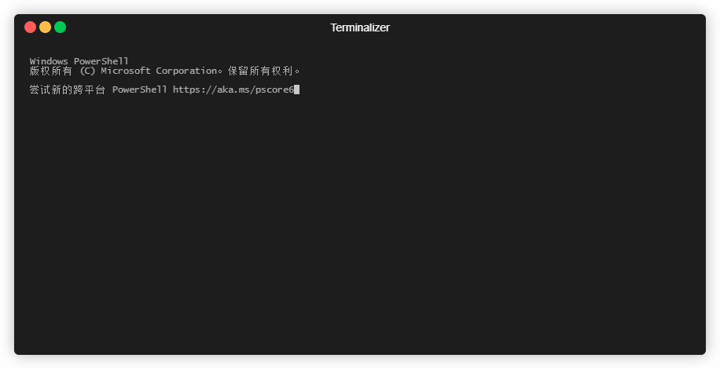

# BypassDuo2FA
Use ADB to automatically complete the 2FA of DUO used by USC, this is equivalent of using your phone as a USB safety key.

# Requirements

* Windows 10 with adb installed and in PATH.
* Android device with DUO installed and USB debugging turned on.

# How To Use

The main script *trig.py* wait for a DUO notification and automatically approve the 2FA by simulating commands via adb. You need to modify the following in trig.py:
* device_id: replace with your android device_id
* pin: replace with your pin to unlock the phone
* depending on your screen resolution, you might also need to adjust the simulated swipe and tap position in the *shell input* command.

This script should be working in any situation when DUO 2FA is required, such as VPN, CARC, Workday, etc.

# Example on CARC Login
*carc.bat* provide an example of using this script to bypass the 2FA required in CARC login. The result should look like this:
